### Идеи

итак на Королевском Фланге:

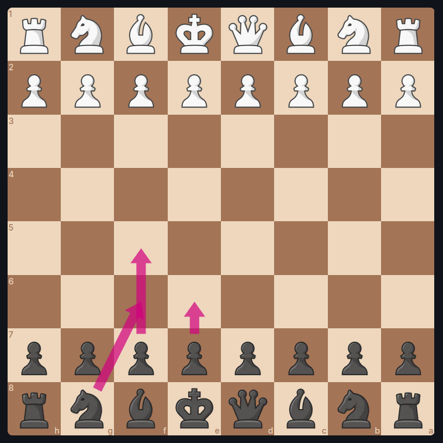

Королевский Слон:

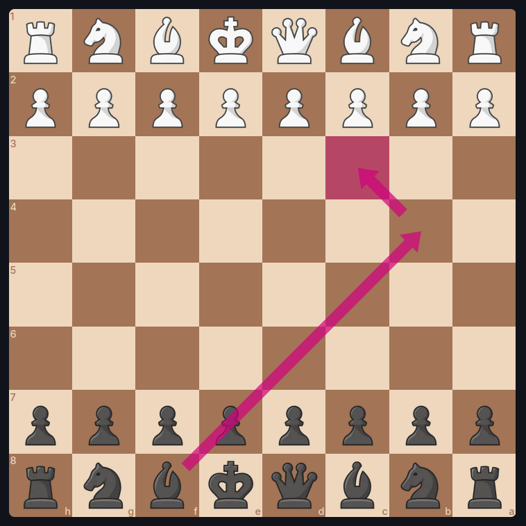

Что Насчет Другово Слона(ведь Пешки его Загараживают): Фионкетто

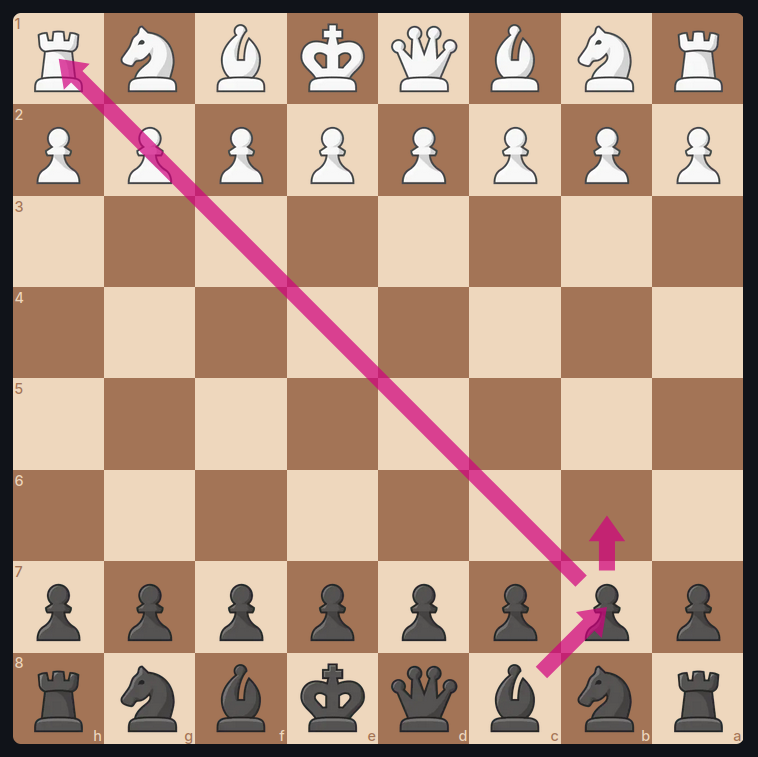

### Теория

1. D4 F5

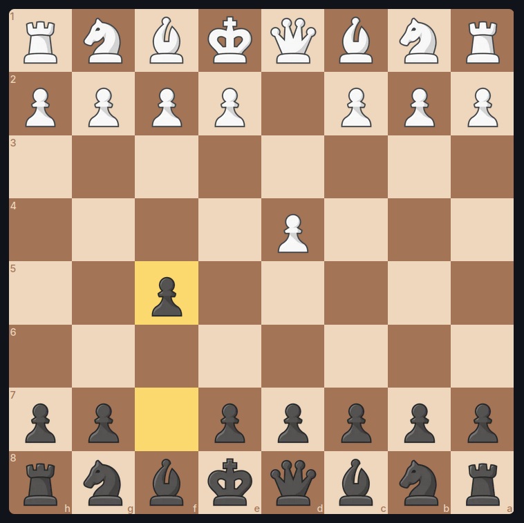
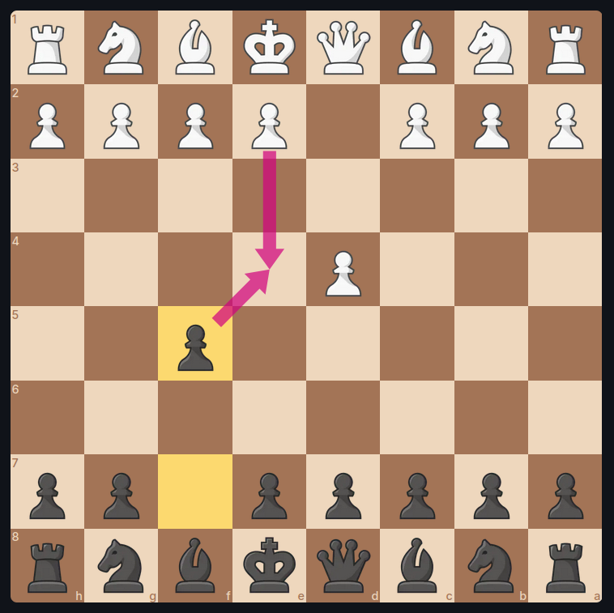

2. C4 KF6

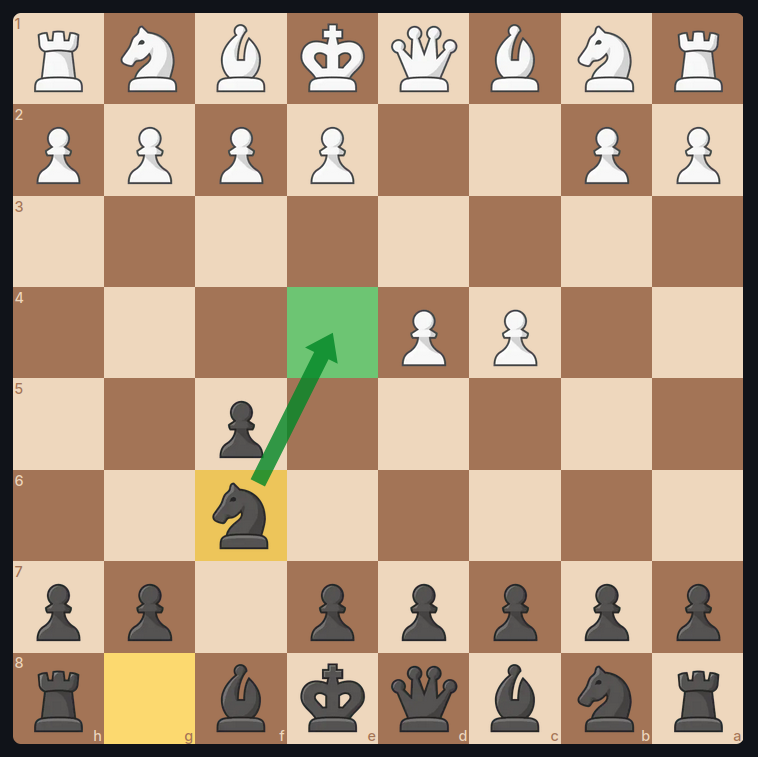

3. KC3 E6

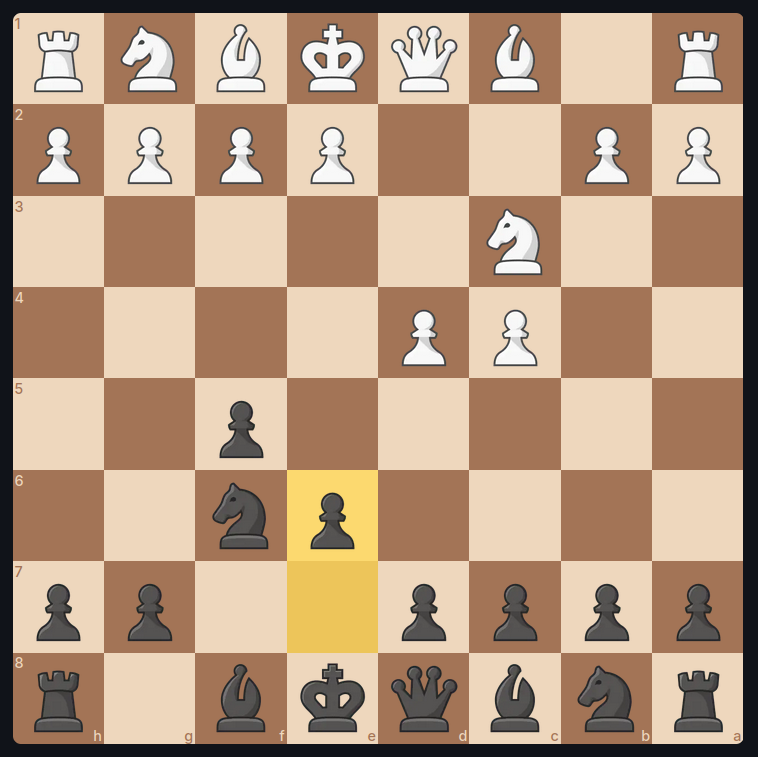

4. KF3 BG5

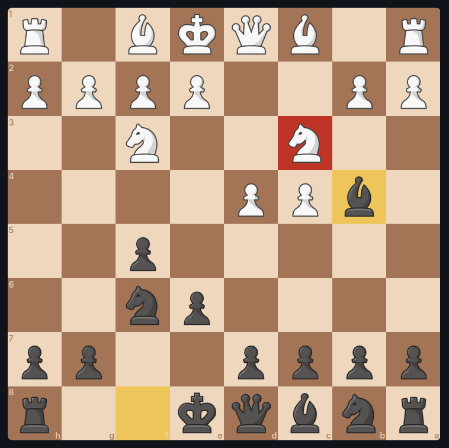

5. BG5

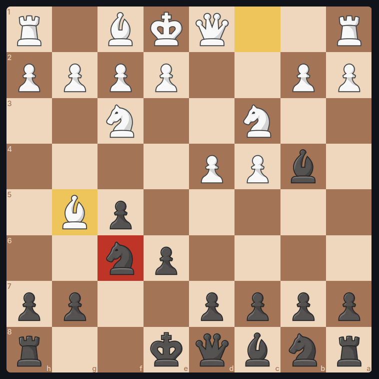

5. ... BC3+

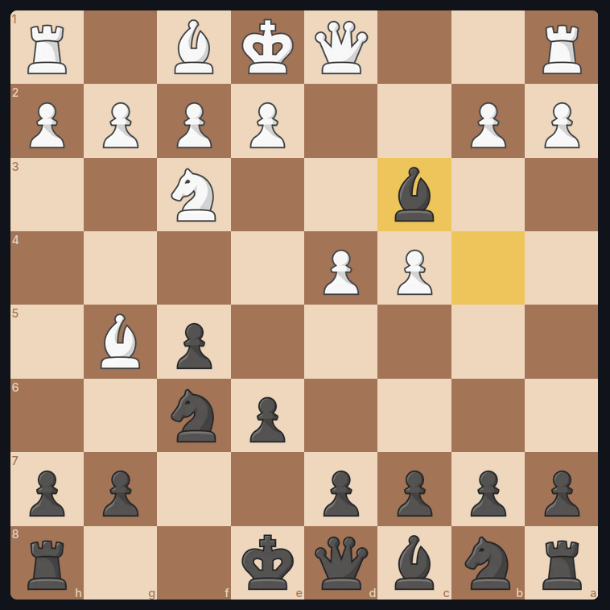

6. BC H6

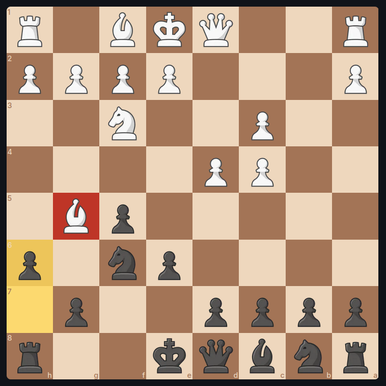

### Камменная Стена

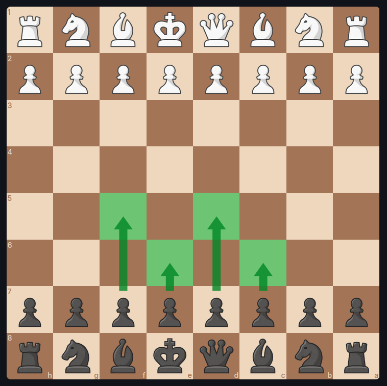

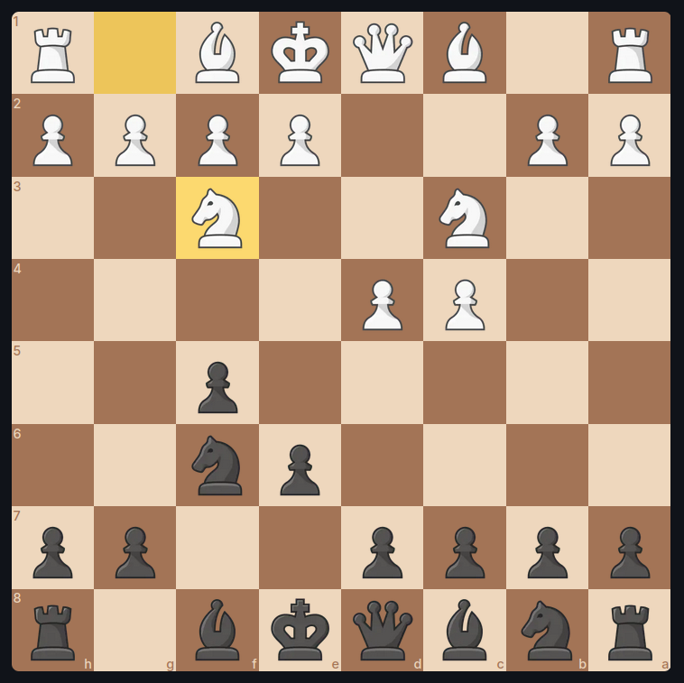

и тут мы делаем

4. D5
